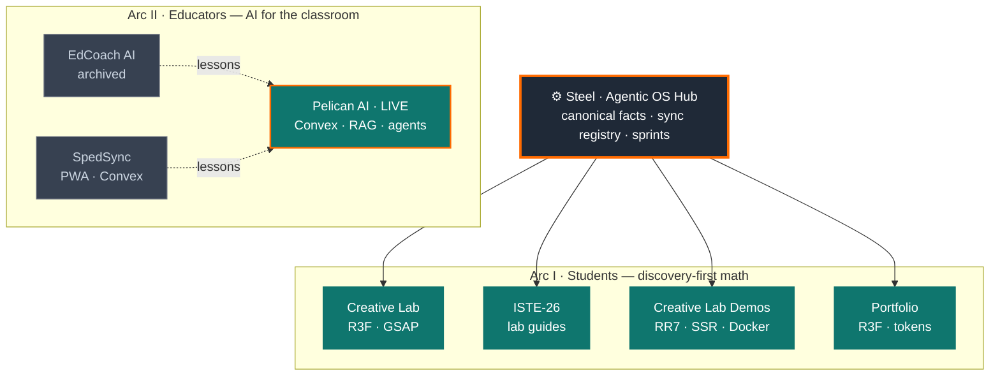

<!-- BANNER -->

  

<!-- ANIMATED TAGLINE -->

  

<!-- QUICK LINKS -->

  
  
  
  

---

I'm a mathematician and 15-year educator who now ships **production interactive software, end-to-end** — WebGL/3D learning environments, real-time full-stack apps, RAG-backed AI tooling, and the agentic system that keeps it all coherent. Everything here is **deployed, used by real people every week, and converging on one stage: ISTE LIVE 2026.**

The domain is education. The interesting part is the engineering: rendering 3D geometry that responds to a learner in real time, keeping an LLM grounded in a strict standards corpus, and orchestrating four repos solo against a hard deadline without a monorepo.

---

## 🛠️ Stack

**Languages**

**Frontend & 3D / Motion**

**Backend & AI**

**Tooling**

---

## 🗺️ System architecture

Two product arcs, one shared brain. **Steel** (an agentic-OS vault) holds canonical facts and keeps the Creative Lab spokes in sync; the educator arc evolved through archived experiments into the live product.

---

## 🧪 Arc I — Interactive math, rendered in real time

> The engineering challenge: 3D geometry that responds to a learner mid-gesture, with formulas gated behind demonstrated understanding.

| Project | Engineering highlight | Stack | |
|---|---|---|---|
| **Creative Lab** | Flagship. Earned-reveal module engine; one reusable geometric fixture across the whole Grade 8 arc + Sinewaves + Vector Transformations. | `R3F` `GSAP` `Storybook` | [repo](https://github.com/Lokie-ree/creative-lab) · [live](https://creative-lab-five.vercel.app) |
| **ISTE-26** | Dual-mode guides (teacher config + student log) driven by a shared standards model. | `Vite` `shadcn/ui` | [repo](https://github.com/Lokie-ree/iste-26) · [live](https://iste-26.vercel.app) |
| **Creative Lab Demos** | Server-rendered demo host (Cross-Section Explorer); ships via Docker or Vercel. | `RR7 SSR` `Docker` | [repo](https://github.com/Lokie-ree/creative-lab-demos) · [live](https://creative-lab-demos.vercel.app) |
| **Portfolio** | Live R3F module previews, GSAP scroll choreography, single-source design tokens mirrored to CSS `oklch()` + Three.js hex. | `R3F` `GSAP` | [repo](https://github.com/Lokie-ree/portfolio) · randalllapointjr.dev |

**The reusable fixture:** a single scalene triangle `A(1,1) B(4,2) C(2,4)` is the invariant across every geometry module — the same object transformed three ways (rigid motions → dilations → Pythagorean), so learners deepen one mental model instead of context-switching. It's the same instinct as reusing a well-designed test fixture.

---

## 🤖 Arc II — AI tooling for educators

> The engineering challenge: keep an LLM useful *and* grounded in a strict, real corpus — no hallucinated standards.

| Project | Engineering highlight | Stack | |
|---|---|---|---|
| **Pelican AI** | Live. Prompt coach with RAG over the Louisiana standards + rubric corpus; Convex agents + workflows, auto-save-on-copy, session management. | `Convex` `RAG` `OpenAI` | [repo](https://github.com/Lokie-ree/aida) · [live](http://pelicanai.org) |
| **EdCoach AI** | Archived predecessor. 5-phase growth-loop platform; early experiment in multi-agent dev workflows. | `Next.js` `Convex` | [repo](https://github.com/Lokie-ree/edcoachai) |
| **SpedSync** | Special-education management PWA on a real-time Convex backend. | `Convex` `PWA` | [repo](https://github.com/Lokie-ree/sped-sync) |

EdCoach AI and SpedSync were the experiments. Each returned a lesson — *narrower scope, conversational over dashboard, domain-specific over generic* — that compounded into **Pelican AI**, the one teachers actually use.

---

## ⚙️ Steel — the system behind the system

Coordinating four related repos solo, against a fixed conference date, is a real engineering problem. **[Steel](https://github.com/Lokie-ree/steel)** is the answer: an Obsidian-based agentic-OS hub that every AI session reads first. It holds the canonical facts (module names, coordinates, URLs, standards), a **sync registry** of cross-repo fields, and time-boxed **sprint docs**.

**Drift policy:** freeze structure, document sync points, *no premature monorepo.* When a user-facing string changes, every affected spoke is updated in the same session. Shared packages get reconsidered only after the deadline ships.

---

## 🔬 Validation loop

Built *with* users, not tested *on* them. The **IVLA STEM Club** meets twice weekly and hits every build as learners first — they're also learning the stack that produces it (React, Vite, R3F). The metric is **observable understanding, not survey scores**: it shows up in how they interact, not what they self-report. Continuous, in-the-loop user testing on a weekly cadence.

---

## 📊 GitHub

  
  

---

## 🧭 What's next (post-ISTE)

**Project Studio** — a scoping engine that turns fuzzy student interests into a *finishable* plan. A knowledge-file-backed Gemini Gem runs a six-stage loop (Spark → Expand → Narrow → Shape → Checkpoint → Export); a companion web app generates a scoped plan — goal, out-of-scope boundaries, milestones, and a 48-hour **Milestone Zero** — then hands off to the Gem with a pre-filled prompt. The archetype library compounds into classroom-specific institutional memory.

> The thesis again, one layer up: the hard thing isn't starting a creative project — it's *finishing* one. So I'm engineering "finishable" into the tooling.

---

## 🎓 Background

**Education** — MS Mathematics (Nicholls State) · MEd Educational Leadership (American College of Education) · BS Mathematics (Nicholls State)

**Teaching** — 15 years: algebra, geometry, advanced mathematics, K–6 STEM, mentoring, technology facilitation.

**Now** — building the tools that scale what 15 years in the classroom taught me about how people actually learn.

---

  <strong>📍 It all converges on ISTE LIVE 2026 · Orlando · June 28 – July 1.</strong>

  

